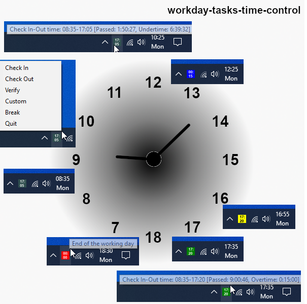
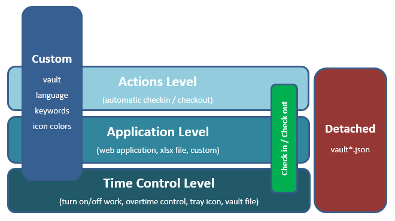
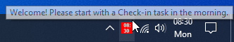

# wdttc2

The new version, pure Python based, of the previous workday-tasks-time-control solution. A modern, customizable, open-source solution that will help you to "*turn on/off work*" and to avoid uncontrolled overtime, or in other words will help you to:	

- keep track of the starting, ending and the total work time during each workday;
- automate the checkin-checkout type of actions you need or want to perform daily, to record the start and the end of the workday;
- have the current workday status visible, and the actions at hand, as a system tray icon, and be notified when checkout time is approaching or if overtime started.

This is mostly useful when you are usually starting the workday at flexible, irregular hours in the morning, and in turn you need to calculate and remember during the day when you started and when you should end the workday (and close the computer), while you want to make sure you worked the required or expected amount of time. Or you are doing overtime regularly while you are in the home office, just in case. Or when you are using a checkin-checkout type of application (e.g. web URL, excel file, other) for recording the start and the end of the working day, which you want to automate.

  

## Quickstart - Standalone app

The standalone executable is created with Miniforge3, Python 3.12, and packed with PyInstaller. This means it works out of the box, in standalone portable mode, without installing anything on the system.

The easiest way to start with this tool is to download the _**standalone-wdttc.zip**_ from the latest release https://github.com/adrian-evo/wdttc2/releases, extract and double click _**wdttc.exe**_ or run _**run-tasks.bat**_ with _Icon_. Then on Windows make the icon visible in the notification area with *Windows Taskbar settings -> Select which icons appear on the taskbar*. Next, right click on the icon and choose _Check In_, and then verify the generated xlsx file.

**NOTE:** Sometimes downloaded files from the internet are blocked by Windows. If there are errors when running a command below, try first to open the Properties of the zip file and click _Unblock_ before extracting it.

## Solution concepts

This is a highly customizable and transparent open-source solution with Python and Playwright libraries for automating web application. It was implemented by using three main concepts: **levels concept**, **check in - check out concept** and **detached concept**. Works on Windows and macOS.

  

**1. Levels concept**

The solution has currently three levels, where each level is built on and adds more complexity to the previous one. The three levels are **time control level**, **application level** and **actions level**. The time control level is enabled by default, the others are disabled and needs to be enabled if you want to use them. Detailed levels concept explanation can be found in the related [document](./docs/levels.md).

**2. Check In - Check Out concept**

The "*Check In*" and "*Check Out*" type of actions will act differently, depending on the level you had enabled and want to use:
- time control level will record in a detached *vault* file the start and the calculated end time of the workday, and will display the workday status as a tray icon.
- application level will automatically open an applications with the given input (e.g. a web URL or an excel file) when you start and end the workday, with the main purpose to record the checkin / checkout times or other similar actions.
- action level will automate the actions on the applications opened on the previous level (e.g. click a button or do a time record)

**3. Detached concept - vault.json file**

Detached concept run means that the solution is totally independent of any continuously running process, and the tray icon is just a handy tool that displays the info found in your *vault.json* file. Running the tasks will read the input from _vault.json_ file and write the new status back in the same file and end the process.

**Customization**

**devdata/env.json** file defines the three customization files needed for this solution:

	"VAULT_FILE": the name of your "devdata/vault.json" file mentioned above. This is the main 
	file that you need to edit and control in order to customize this solution for your own needs.

	"LOCALE": currently two languages are included, "en" for English and "de" for German. The language
	files are under "locales" folder and can be customized.

	"MINIFORGE3_PATH": the local path to Miniforge3 installation, if Miniforge3 is used as Python environment (recommended)

	"TASK_WAIT_TIMEOUT": timeout in seconds to wait before the task in command prompt will be executed.

**plugins**
As an example, this solution includes two custom keywords files. Any of them can be used as a template to be customised for a particular company system, for certain internal system or application, case by case. These files are not used on first level, thus can be ignored initially.

- *cust_keywords.py* default to be used for opening or editing an excel file
- *url_keywords.py* to be used for opening a web application. Rename as *cust_keywords.py* to this into use instead of default one.

## Use with Python environment (not standalone)

:arrow_double_down: Download this solution
> Download the latest version from under the _Releases_ section and then extract it to any local folder.

:hammer: Install Python environment if not already available (recommended with miniforge3 but choco or standard installation can be also used)
> For e.g. miniforge3, first install it, then set "MINIFORGE3_PATH" in _devdata\env.json_ and then execute _**tools/setup-miniforge-env.bat**_ on Windows.

:o2: Run the "*Icon*" task
> Execute _**run-tasks.bat**_ on Windows or _**run-tasks.command**_ on macOS and then choose "*Icon*" task. Optionally check the [detailed instructions](#the-tasks-and-how-to-run-them) below about the tasks and the alternative ways to run them.

**NOTE. For macOS:** The files to run tasks on macOS are _run-tasks.command_ and _run-tasks.sh_ and are located under _tools_ directory. Move them under root directory and move _run-tasks.bat_ for Windows under _tools_ directory. Also note that the **.command** file on macOS need to set **_chmod +x file_** before executing, and then for first run choose "Open With -> Terminal" from Finder, due to macOS permisssion restrictions.

If everything was installed correctly, then a system tray red icon will be displayed with the current time on it:

  

On Windows, you can keep the icon visible in the notification area with *Windows Taskbar settings -> Select which icons appear on the taskbar*. On macOS, the icon is always visible.  

:arrows_clockwise: Take the solution into daily use

After the first run, Quit the icon from the icon menu and then do the following:

- make a copy of the *devdata/vault.json* with any name (e.g. *vault-my.json*) and take it into use by editing the "VAULT_FILE" entry from *devdata/env.json*

- run again the "*Icon*" task

- run any other task freely, right away for experimentation purposes. Due to detached concept solution, any task run on the first level will just modify your custom _vault.json_ file accordingly. Obviously this vault file can be any time restored with the initial content.

## The tasks and how to run them

**The five tasks** that you can run, and three ways you can run them:

- **In** - for "*Workday Check In*"
- **Out** - for "*Workday Check Out*"
- **Verify** - for "*Workday Verify*"
- **Custom** - for "*Custom Task*"
- **Icon** - for displaying the tray icon

**The three ways** to run the tasks are:

1. From within project directory folder, with double click on _**run-tasks.bat**_ on Windows or _**run-tasks.command**_ on macOS, then choose task name to run.

2. From **Command prompt** on Windows or **Terminal** on macOS, by executing the following command in the project directory folder, where you will replace the Task word with the actual task name as defined above

> **_python src/tasks.py choice_** (e.g., python src/tasks.py "Icon").

3. From the "**Icon menu**", after executing any of the *In*, *Out* or *Icon* task since any of these tasks will also display the tray icon.

**Detailed tasks explanation:**

- "*Check In*": to start the workday, calculate, save, and display the end of the workday as an icon text and tooltip. In addition, for second level will open the checkin application. For third level will do the checkin actions.
- "*Check Out*": to end the workday, reset the check in data and the text icon, and display the total worked time statistics. In addition, for second level will open the checkin application. For third level will do the checkout actions.
- "*Verify*": any time during the day, to verify worked, remaining and under or overtimes. In addition, for second level will open the checkin application for verification purposes.
- "*Custom*": for first level will do nothing. For second level will open the custom application and for third level will do the custom actions.
- "*Icon*":  to display the tray icon, which is the essence of the time control on the first level. The icon is also displayed during "*Check In*" and "*Check Out*" tasks executions and it can be restarted automatically after operating system reboot. Quit the icon and rerun the task any time you edit *devdata/env.json* to use custom vault or language.

- "*Break*" icon menu is not a task, but it will simply pause the work and will extend the workday by extending the calculated checkout time. To make things easier, you can include the regular lunch break in the standard working time (e.g., use 8h30’ instead of 8h for the STANDARD_WORKING_TIME entry) and then use this menu break for any additional breaks that should normally extend the workday.

**'Hidden' tasks:**
- "*Startup*": to enable automatic icon restart by the operating system.
- "*Language*": to regenerate the locales after replacing text messages with own custom text.

## Other documentation

**Solution levels**

- [Time control level](./docs/levels.md#time-control-level)
- [Application level](./docs/levels.md#application-level)
- [Actions level](./docs/levels.md#actions-level)

**How to and other useful info**

- [How to enable automatic icon restart by the operating system?](./docs/howto.md#how-to-enable-automatic-icon-restart-by-the-operating-system)
- [What happens if you don't check out after check in or if you check in twice without check out first?](./docs/howto.md#what-happens-if-you-dont-check-out-after-check-in-or-if-you-check-in-twice-without-check-out-first)
- [What if something is not working correctly?](./docs/howto.md#what-if-something-is-not-working-correctly)
- [What is the meaning of different icon colors and how to customize them?](./docs/howto.md#what-is-the-meaning-of-different-icon-colors-and-how-to-customize-them)
- [What is the meaning of different output section data?](./docs/howto.md#what-is-the-meaning-of-different-output-section-data)
- [How to store the credentials in the specific system keyring service](./docs/howto.md#how-to-store-the-credentials-in-the-specific-system-keyring-service)
- [How to translate all or replace text messages with own custom text](./docs/howto.md#how-to-translate-all-or-replace-text-messages-with-own-custom-text)
