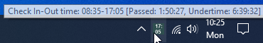
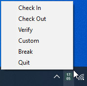
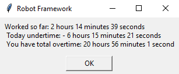

## Solution levels

## Time control level
 
This is the first basic level that is enabled by default and works out of the box. When executing the "*Check In*" task, the current time and the calculated checkout times are recorded in your *vault.json* file. When doing a "*Verify*" task, the under or overtime worked for today, and the total cumulated under or overtime, over multiple days, are displayed. When executing the "*Check Out*" task, the check in time is reset and, cumulated over or undertime is updated.

Of course, having such information in a vault file is not very useful, that's why a tray icon is displayed and it will show all the above information as an easy to read tooltip. The calculated check out time is displayed as a text on the icon, so that you can easily keep track when the workday should end. In addition, you can also easily launch the specified tasks from the icon menu. More details in the following images:

Windows:

  
  

macOS:

  

"*Verify*" task message:

  

The following customizations from *vault.json* file are useful for this level:

"LEVEL_1_ACTIONS":

    "SILENT_RUN": to enable or disable the "*Welcome*" and "*Goodbye*" messages
	at the beginning and at the end of tasks execution.

    "ICON_CLICK_BREAK_ON_OFF": to enable or disable the Break with a single click on the icon.

    "ICON_DOUBLE_CLICK_CHECKIN_OUT": to enable or disable the Checkin and out with a double click on the icon.

    "ICON_DOUBLE_CLICK_CONFIRMATION": to enable or disable a confirmation dialog for double click, so that to avoid accidental double click.

"MY_DATA":

     "STANDARD_WORKING_TIME": "8 hours 30 minutes" (e.g. this working time includes
	 by default the daily 30' lunch break)

## Application level

Depending of the *cust_keywords.py* file taken into use from the *plugins* directory, on the second level the "*Check In*" and "*Check Out*" tasks will open either a web application either an excel file.

**URL Keywords** 

Start with a copy of *url_keywords.py* with the name *cust_keywords.py*, then edit the keyword _Fill Checkin Credentials_ with own HTML selectors as needed by Playwright libraries. By default, you can run it as it is with sample URLs.

1. Open your *vault.json* file and enable 

"LEVEL_2_ACTIONS":

	"OPEN_CHECKIN_APP": true
	"OPEN_CHECKOUT_APP": true
	"OPEN_CUSTOM_APP": true

2. Execute any of the "*Check in*" or "*Check out*" tasks and test if the included sample *mail.yahoo* page is opened with the message that credentials are not found. This is as expected.

3. Execute "*Custom*" task and test that the included sample weather application is opened.

4. Optionally, if you want to continue the experiment with *mail.yahoo*, then add your username and password in your *vault.json* file and run the tasks to test if the credentials are automatically filled by the application level.

Open your *vault.json* file and edit the following under "MY_DATA", "CHECKIN" section:

	"CHECKIN.SYSTEM": The name of the system is an arbitrary name used to store the credentials in the 
	corresponding system keyring service, depending on the operating system.
	
	"CHECKIN.PASSWORD": Use temporary for test runs, then it is recommended that you switch to system 
	keyring service so that to avoid plaintext password in your vault file. When the password is empty, 
	the solution will assume the system keyring service will provide the password.

	"CHECKIN.USER": You can keep the username in your vault file, but you can also save it in the system keyring 
	service, under the entry named "*username*" if you want to.

See this section for details about [how to store the credentials in the specific system keyring service](./howto.md#how-to-store-the-credentials-in-the-specific-system-keyring-service)

5. Optionally, if you want to open your own URLs instead of the default ones, then open your *vault.json* file and edit the following:

"MY_DATA":

	"CHECKIN.URL": own checkin URL
	"CUSTOM.URL": own custom URL

	"CHECKIN.SYSTEM": Your_system
	"CHECKIN.PASSWORD": ""
	"CHECKIN.USER": ""

In this case, when executing any of the "*Check in*", "*Check out*" or "*Custom*" tasks, your defined web applications will be opened instead, but obviously without credential filling.

**XLS Keywords** 

If you are interested to open or edit an excel file, the default *cust_keywords.py*, contains a default implementation for this. Adjust the implementation as needed. Then open your *vault.json* file and edit the following:

"MY_DATA":

	"CHECKIN.XLS": path to your excel file (e.g. "C:/Data/logging.xlsx"
	or similar in Windows, but always use slash for the path. For macOS it might be "/Users/user/Data/logging.xlsx", or relative path, e.g. just "logging.xlsx".)

The file will be created automatically if not exists, or it must be an empty excel file that you want to use to record checkin / checkout times. When actions level is enabled, these will be filled automatically in the excel file without starting the Excel application.

**Company keywords**

Start with a copy of *url_keywords.py* with the name *cust_keywords.py*, then edit the keyword _Fill Checkin Credentials_ with own HTML selectors as needed by Playwright libraries. This file should provide a particular custom checkin / checkout solution or similar for a particular company, or for certain internal system or application, case by case. This file will be usually accompanied by a custom *vault-comp.json*, which means also "VAULT_FILE" could be edited to use this file instead, e.g.:

    "VAULT_FILE": "devdata/vault-comp.json",
    "LOCALE": "de",

## Actions level

The third level might be a little bit more complex, and depending of the specific application might require more complex modifications on the *cust_keywords.py* file so that to be able to automatize the actual actions that otherwise are expected to be done manually on the second level.

However, using the included _cust_keywords.py_ works out of the box, and when this level is enabled, the checkin / checkout times will be filled automatically in the excel file without starting the Excel application.

1. To enable this level, open your *vault.json* file and enable 

"LEVEL_3_ACTIONS":

	"DO_CHECKIN_ACTION": true
	"DO_CHECKOUT_ACTION": true
	"DO_CUSTOM_ACTION": true

2. Execute any of the "*Check in*", "*Check out*" or "*Custom*" tasks, and for the web application you will get the message that the automatic action was not implemented. This is as expected. For excel application, the automatic action will be executed.

For web application, this means the actions level is useful when you are using a customised **cust_keywords.py** file with your own actions, by editing the keywords _Checkin App Task_, _Check Out App Task_ and _Custom App Task_, with own clicks on the HTML selectors, as needed by Playwright libraries.

At the end all the required actions should be customized and implemented accordingly, so that the whole Check in / Check out experience happens without any user intervention other than launching the tasks.
